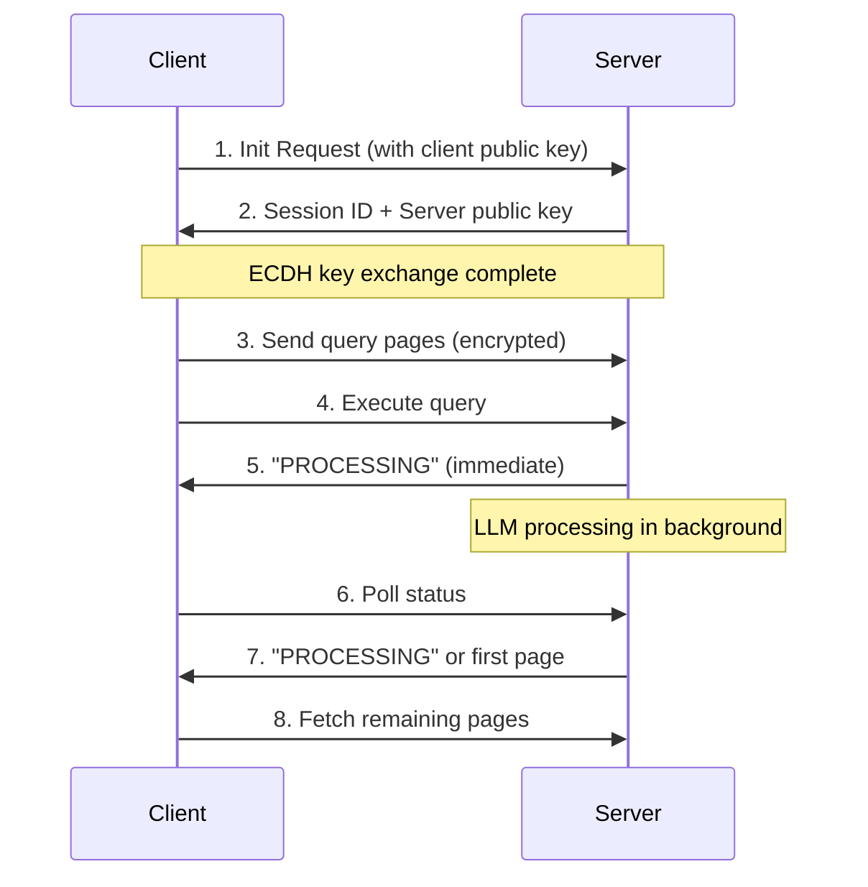

# DoNutSentry v2 - Complete Technical Manual

## Table of Contents
1. [Overview](#overview)
2. [Architecture](#architecture)
3. [Protocol Flow](#protocol-flow)
4. [Session Setup](#session-setup)
5. [Query Paging](#query-paging)
6. [Async Processing](#async-processing)
7. [Response Paging](#response-paging)
8. [Encryption](#encryption)
9. [Error Handling](#error-handling)
10. [Implementation Guide](#implementation-guide)
11. [Testing](#testing)
12. [Security Considerations](#security-considerations)

## Overview

DoNutSentry v2 is a DNS-based query protocol that allows sending arbitrarily large queries to an LLM through DNS TXT records. It solves the fundamental limitation of DNS (255 character domain names, 63 character labels) by implementing:

- **Session-based communication** with ephemeral encryption
- **Query/response paging** for large content
- **Async processing** to handle DNS timeout constraints
- **XOR encryption** with zero overhead
- **Automatic cleanup** and error handling

### Key Features
- Send queries of any size through DNS
- Receive paginated responses
- End-to-end encryption with perfect forward secrecy
- No authentication required - sessions are ephemeral
- Handles DNS 5-second timeout gracefully

## Architecture

### Components

1. **Server** (donutsentry_v2.go)
   - Runs on port 8053 (development) or 53 (production)
   - Handles DNS queries for `*.qp.ch.at` domain
   - Manages sessions in memory
   - Calls LLM API (OpenAI/Anthropic)

2. **Client Library** (TypeScript)
   - Manages session lifecycle
   - Handles query/response paging
   - Implements encryption
   - Provides simple API

3. **DNS-HTTP Bridge** (for browsers)
   - Proxies DNS queries over HTTP
   - Enables browser-based demos
   - Runs on port 8081

### Domain Structure

All queries follow this pattern:
```
<data>.<operation>.qp.ch.at
```

Operations:
- `init` - Initialize session
- `exec` - Execute query
- `status` - Check processing status
- `page.N` - Fetch response page N
- Query pages use positional notation

## Protocol Flow

### Complete Query Flow



## Session Setup

### 1. Client Generates Keys
```typescript
// Generate ephemeral X25519 keypair
const clientKeyPair = nacl.box.keyPair();
```

### 2. Init Request Format
```
<client_enc_pubkey_base32>.<client_sig_pubkey_base32>.init.qp.ch.at
```

Example:
```
MTELJRVVPXGCW3XB6TQMHT4LLIEZUEDCT6GLR66SR7XH7DX27Z5Q.O4FWUD65C2KPCPECTBNFQJB5HZ3QNANW3357FT5O5OYDJJWYBX3Q.init.qp.ch.at
```

### 3. Server Response
The server returns a base64-encoded response containing:
- Encrypted session ID (76 chars)
- Server public keys (103 chars base32)

### 4. Shared Secret Derivation
Both sides compute:
```go
sharedSecret = ECDH(myPrivateKey, theirPublicKey)
```

### 5. Session Storage
Server stores:
```go
type DoNutV2Session struct {
    ID                   string
    ClientEncPubKey      []byte
    ClientSigPubKey      []byte
    ServerKeys           *ECCKeyPair
    SharedSecret         []byte
    QueryPages          map[int]string
    ResponsePages       map[int][]byte
    TotalResponsePages  int
    CreatedAt           time.Time
    LastActivity        time.Time
}
```

## Query Paging

### Page Size Calculation
Each DNS label can hold 63 characters. After base32 encoding (1.6x expansion):
- Usable bytes per label: 63 / 1.6 = ~39 bytes
- Pages are numbered: 0, 1, 2, ... (base32: AA, AE, AI, ...)

### Sending Query Pages
Format:
```
<session_id>.<page_num>.<encrypted_content_base32>.qp.ch.at
```

Example (page 0):
```
YNUXXWIU2LHUMIZPHKCE3VZT3I.AA.D5IAXWBXRNO4BPOBAI.qp.ch.at
```

### Query Assembly
1. Client splits query into 39-byte chunks
2. Each chunk is XOR encrypted with page-specific key
3. Encrypted chunk is base32 encoded
4. Sent as individual DNS query

## Async Processing

### The DNS Timeout Problem
DNS resolvers timeout after ~5 seconds, but large LLM queries can take longer.

### Solution: Async Execution

1. **Immediate Response**
```go
// Return "PROCESSING" immediately
respondWithTXT(m, q, "PROCESSING")
w.WriteMsg(m)  // Send DNS response now!

// Process in background
go func() {
    llmResp, err := LLM(query, nil)
    // Store response when ready
}()
```

2. **Status Polling**
```typescript
while (pollCount < 60) {
    await sleep(1000);
    const status = await resolver.resolveTxt(`${sessionId}.status.qp.ch.at`);
    
    if (status === 'PROCESSING') {
        continue;
    }
    
    // Response ready - status contains first page
    return parseResponse(status);
}
```

## Response Paging

### Response Format
Each response page contains:
- Metadata: `[Page N/M]`
- Content: Actual response text

### Fetching Pages
Format:
```
<session_id>.page.<number>.qp.ch.at
```

Example:
```
YNUXXWIU2LHUMIZPHKCE3VZT3I.page.2.qp.ch.at
```

## Encryption

### XOR Encryption (Zero Overhead)

1. **Key Derivation per Page**
```go
func DeriveXORKey(sharedSecret []byte, context string, length int) []byte {
    hkdf := hkdf.New(sha256.New, sharedSecret, nil, []byte(context))
    key := make([]byte, length)
    hkdf.Read(key)
    return key
}
```

2. **Context Strings**
- Query pages: `"query:page:0"`, `"query:page:1"`, etc.
- Response pages: `"response:page:0"`, `"response:page:1"`, etc.

3. **Encryption**
```go
func XOREncrypt(plaintext, key []byte) []byte {
    ciphertext := make([]byte, len(plaintext))
    for i := range plaintext {
        ciphertext[i] = plaintext[i] ^ key[i]
    }
    return ciphertext
}
```

## Error Handling

### Session States
- `TotalResponsePages = 0` - Created, no query
- `TotalResponsePages = -1` - Processing
- `TotalResponsePages = -2` - Failed
- `TotalResponsePages > 0` - Ready

### Error Response
When LLM fails:
1. All session data cleared immediately
2. Session kept alive for 5 minutes
3. Status returns "FAILED"

### Automatic Cleanup
- Sessions expire after 5 minutes
- Stuck processing cleaned after 2 minutes
- Cleanup runs every minute

## Implementation Guide

### Server Setup

1. **Environment Configuration**
```bash
# .env file
OPENAI_API_KEY=sk-...
# or
ANTHROPIC_API_KEY=sk-ant-...
```

2. **Start Server**
```bash
go run . -debug=true
```

### Client Usage

1. **Install Client**
```bash
npm install @ch.at/donutsentry-client
```

2. **Basic Query**
```typescript
const client = new DoNutSentryClient({
    domain: 'qp.ch.at',
    dnsServers: ['127.0.0.1:8053']
});

const result = await client.query('What is DNS?');
console.log(result.response);
```

3. **Large Query**
```typescript
// Automatically handles paging and async
const result = await client.query(veryLongQuery);
console.log(`Query pages: ${result.metadata.totalQueryPages}`);
console.log(`Response pages: ${result.metadata.totalResponsePages}`);
```

### DNS Bridge (for Browsers)

1. **Start Bridge**
```bash
node dns-http-bridge.js
```

2. **Browser Configuration**
```javascript
async function dnsQuery(domain) {
    const response = await fetch(`http://localhost:8081/dns/query?domain=${domain}&type=TXT`, {
        cache: 'no-store'  // Important!
    });
    const data = await response.json();
    return data.records;
}
```

## Testing

### Test Commands

1. **Simple Query**
```bash
dig @127.0.0.1 -p 8053 test.init.qp.ch.at TXT
```

2. **Client Library Tests**
```bash
node test-v2-async-complete.js
node test-huge-llm-query.js
```

### Performance Benchmarks
- Small query (12 chars): 2-3 seconds
- Medium query (159 chars): 3-5 seconds  
- Huge query (1512 chars): 4-6 seconds

## Security Considerations

### Strengths
1. **Perfect Forward Secrecy** - New keys per session
2. **No Long-term Keys** - Everything ephemeral
3. **Data Protection** - Errors clear all data
4. **Limited Attack Surface** - 5-minute session lifetime

### Limitations
1. **No Authentication** - Anyone can query
2. **DNS Amplification** - Potential DDoS vector
3. **Query Visibility** - DNS queries logged by resolvers
4. **Resource Consumption** - Each session uses memory

### Mitigations
- Rate limiting by IP
- Session count limits
- Automatic cleanup
- Input validation

## Troubleshooting

### Common Issues

1. **"PROCESSING" Forever**
   - Check server logs for LLM errors
   - Verify API keys are valid
   - Check DNS bridge isn't caching

2. **DNS Timeouts**
   - Ensure async processing is enabled
   - Check server is returning "PROCESSING"
   - Verify client polling logic

3. **Session Not Found**
   - Sessions expire after 5 minutes
   - Check session ID format
   - Verify server received init

### Debug Mode
Enable comprehensive logging:
```bash
go run . -debug=true
```

Check logs for:
- `[DonutSentryV2 Init]` - Session creation
- `[DonutSentryV2 Async]` - Background processing
- `[DonutSentryV2 Status]` - Status checks
- `[DonutSentryV2 Cleanup]` - Session cleanup

## Conclusion

DoNutSentry v2 provides a robust solution for sending large queries through DNS. The combination of session management, paging, async processing, and encryption creates a system that works within DNS constraints while providing a good user experience. The protocol is designed to fail safely and clean up automatically, making it suitable for production use.